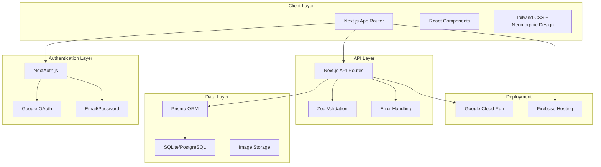

# Design Document

## Overview

This design document outlines the architecture and implementation approach for enhancing the existing Hangar-on wardrobe management application. The design builds upon the current clean Next.js application structure while adding essential production features including authentication, database persistence, and enhanced user experience features.

The application will maintain its current neumorphic design system and mobile-first approach while adding robust backend functionality to support individual user accounts with private wardrobe catalogs.

## Architecture

### High-Level Architecture



### Technology Stack

**Frontend:**
- Next.js 15 with App Router (existing)
- React 19 (existing)
- TypeScript 5 (existing)
- Tailwind CSS (existing)
- Existing neumorphic design components

**Backend:**
- Next.js API Routes
- Prisma ORM
- SQLite (development) / PostgreSQL (production)
- NextAuth.js for authentication

**Infrastructure:**
- Firebase Hosting for static assets
- Google Cloud Run for API (if needed)
- Firebase Storage for images
- Zod for validation

## Components and Interfaces

### Database Schema

```prisma
model User {
  id        String   @id @default(cuid())
  email     String   @unique
  name      String?
  image     String?
  createdAt DateTime @default(now())
  updatedAt DateTime @updatedAt
  
  garments  Garment[]
  
  @@map("users")
}

model Garment {
  id          String   @id @default(cuid())
  name        String
  category    String
  material    String?
  color       String?
  size        String?
  brand       String?
  purchaseDate DateTime?
  cost        Float?
  careInstructions String?
  notes       String?
  status      GarmentStatus @default(CLEAN)
  createdAt   DateTime @default(now())
  updatedAt   DateTime @updatedAt
  
  userId      String
  user        User     @relation(fields: [userId], references: [id], onDelete: Cascade)
  
  images      GarmentImage[]
  tags        GarmentTag[]
  
  @@map("garments")
}

model GarmentImage {
  id        String   @id @default(cuid())
  url       String
  alt       String?
  order     Int      @default(0)
  createdAt DateTime @default(now())
  
  garmentId String
  garment   Garment  @relation(fields: [garmentId], references: [id], onDelete: Cascade)
  
  @@map("garment_images")
}

model Tag {
  id        String   @id @default(cuid())
  name      String   @unique
  color     String?
  createdAt DateTime @default(now())
  
  garments  GarmentTag[]
  
  @@map("tags")
}

model GarmentTag {
  garmentId String
  tagId     String
  
  garment   Garment @relation(fields: [garmentId], references: [id], onDelete: Cascade)
  tag       Tag     @relation(fields: [tagId], references: [id], onDelete: Cascade)
  
  @@id([garmentId, tagId])
  @@map("garment_tags")
}

enum GarmentStatus {
  CLEAN
  DIRTY
  WORN_2X
  NEEDS_WASHING
}
```

### API Endpoints

**Authentication:**
- `GET /api/auth/*` - NextAuth.js endpoints
- `GET /api/auth/session` - Current user session

**Garments:**
- `GET /api/garments` - List user's garments with filtering
- `POST /api/garments` - Create new garment
- `GET /api/garments/[id]` - Get specific garment
- `PUT /api/garments/[id]` - Update garment
- `DELETE /api/garments/[id]` - Delete garment
- `PATCH /api/garments/[id]/status` - Quick status update

**Images:**
- `POST /api/images/upload` - Upload and crop garment images
- `DELETE /api/images/[id]` - Delete image

**Tags:**
- `GET /api/tags` - List user's tags
- `POST /api/tags` - Create new tag
- `PUT /api/tags/[id]` - Update tag
- `DELETE /api/tags/[id]` - Delete tag

**Search:**
- `GET /api/search?q=query` - Search garments by name, category, material

### Component Structure

Building on the existing Hangar-on components:

```
src/
├── app/
│   ├── (auth)/
│   │   ├── login/
│   │   └── register/
│   ├── dashboard/
│   │   ├── page.tsx (enhanced existing)
│   │   ├── add/
│   │   ├── garment/[id]/
│   │   └── settings/
│   ├── api/
│   │   ├── auth/
│   │   ├── garments/
│   │   ├── images/
│   │   ├── tags/
│   │   └── search/
│   └── globals.css (existing)
├── components/
│   ├── ui/ (existing neumorphic components)
│   ├── auth/
│   │   ├── LoginForm.tsx
│   │   └── AuthProvider.tsx
│   ├── garments/
│   │   ├── GarmentCard.tsx (enhanced existing)
│   │   ├── GarmentForm.tsx
│   │   ├── GarmentGrid.tsx
│   │   ├── QuickActions.tsx
│   │   └── StatusBadge.tsx
│   ├── images/
│   │   ├── ImageUpload.tsx
│   │   ├── ImageCropper.tsx
│   │   └── ImageGallery.tsx
│   ├── search/
│   │   ├── SearchBar.tsx (enhanced existing)
│   │   └── FilterPanel.tsx
│   ├── tags/
│   │   ├── TagInput.tsx
│   │   ├── TagList.tsx
│   │   └── TagFilter.tsx
│   ├── Layout.tsx (existing)
│   ├── Header.tsx (existing)
│   └── BottomNavigation.tsx (existing)
├── lib/
│   ├── auth.ts
│   ├── db.ts
│   ├── validations.ts
│   ├── utils.ts (existing)
│   └── types.ts
└── hooks/
    ├── useGarments.ts
    ├── useTags.ts
    ├── useSearch.ts
    └── useAuth.ts
```

## Data Models

### Core Types

```typescript
// User types
interface User {
  id: string;
  email: string;
  name?: string;
  image?: string;
  createdAt: Date;
  updatedAt: Date;
}

// Garment types
interface Garment {
  id: string;
  name: string;
  category: string;
  material?: string;
  color?: string;
  size?: string;
  brand?: string;
  purchaseDate?: Date;
  cost?: number;
  careInstructions?: string;
  notes?: string;
  status: GarmentStatus;
  userId: string;
  images: GarmentImage[];
  tags: Tag[];
  createdAt: Date;
  updatedAt: Date;
}

interface GarmentImage {
  id: string;
  url: string;
  alt?: string;
  order: number;
  garmentId: string;
}

interface Tag {
  id: string;
  name: string;
  color?: string;
}

enum GarmentStatus {
  CLEAN = 'CLEAN',
  DIRTY = 'DIRTY',
  WORN_2X = 'WORN_2X',
  NEEDS_WASHING = 'NEEDS_WASHING'
}

// API types
interface CreateGarmentRequest {
  name: string;
  category: string;
  material?: string;
  color?: string;
  size?: string;
  brand?: string;
  purchaseDate?: string;
  cost?: number;
  careInstructions?: string;
  notes?: string;
  images: File[];
  tags: string[];
}

interface UpdateGarmentStatusRequest {
  status: GarmentStatus;
}

interface SearchGarmentsParams {
  q?: string;
  category?: string;
  status?: GarmentStatus;
  tags?: string[];
  limit?: number;
  offset?: number;
}
```

### Validation Schemas

```typescript
import { z } from 'zod';

export const createGarmentSchema = z.object({
  name: z.string().min(1, 'Name is required').max(100),
  category: z.string().min(1, 'Category is required'),
  material: z.string().optional(),
  color: z.string().optional(),
  size: z.string().optional(),
  brand: z.string().optional(),
  purchaseDate: z.string().datetime().optional(),
  cost: z.number().positive().optional(),
  careInstructions: z.string().optional(),
  notes: z.string().optional(),
  tags: z.array(z.string()).default([])
});

export const updateGarmentStatusSchema = z.object({
  status: z.enum(['CLEAN', 'DIRTY', 'WORN_2X', 'NEEDS_WASHING'])
});

export const searchGarmentsSchema = z.object({
  q: z.string().optional(),
  category: z.string().optional(),
  status: z.enum(['CLEAN', 'DIRTY', 'WORN_2X', 'NEEDS_WASHING']).optional(),
  tags: z.array(z.string()).optional(),
  limit: z.number().min(1).max(100).default(20),
  offset: z.number().min(0).default(0)
});
```

## Error Handling

### Error Types

```typescript
export class AppError extends Error {
  constructor(
    message: string,
    public statusCode: number = 500,
    public code?: string
  ) {
    super(message);
    this.name = 'AppError';
  }
}

export class ValidationError extends AppError {
  constructor(message: string, public field?: string) {
    super(message, 400, 'VALIDATION_ERROR');
  }
}

export class NotFoundError extends AppError {
  constructor(resource: string) {
    super(`${resource} not found`, 404, 'NOT_FOUND');
  }
}

export class UnauthorizedError extends AppError {
  constructor(message: string = 'Unauthorized') {
    super(message, 401, 'UNAUTHORIZED');
  }
}
```

### Error Handling Strategy

1. **API Route Error Handling:**
   - Wrap all API routes with try-catch
   - Return consistent error responses
   - Log errors for debugging

2. **Client-Side Error Handling:**
   - React Error Boundaries for component errors
   - Toast notifications for user-facing errors
   - Graceful degradation for network issues

3. **Form Validation:**
   - Client-side validation with Zod
   - Server-side validation for security
   - Clear error messages for users

## Testing Strategy

### Testing Approach

1. **Unit Tests:**
   - Utility functions
   - Validation schemas
   - Custom hooks
   - Individual components

2. **Integration Tests:**
   - API routes with database
   - Authentication flows
   - Image upload functionality

3. **Component Tests:**
   - User interactions
   - Form submissions
   - Status updates
   - Search functionality

### Test Structure

```
tests/
├── __mocks__/
│   ├── next-auth.ts
│   └── prisma.ts
├── components/
│   ├── GarmentCard.test.tsx
│   ├── GarmentForm.test.tsx
│   └── SearchBar.test.tsx
├── api/
│   ├── garments.test.ts
│   ├── auth.test.ts
│   └── search.test.ts
├── hooks/
│   ├── useGarments.test.ts
│   └── useAuth.test.ts
└── utils/
    ├── validation.test.ts
    └── db.test.ts
```

### Testing Tools

- **Vitest** - Fast test runner with TypeScript support
- **React Testing Library** - Component testing
- **MSW** - API mocking for tests
- **Test Database** - Separate SQLite database for tests

This design maintains the existing clean architecture while adding the necessary production features for a robust wardrobe management application.