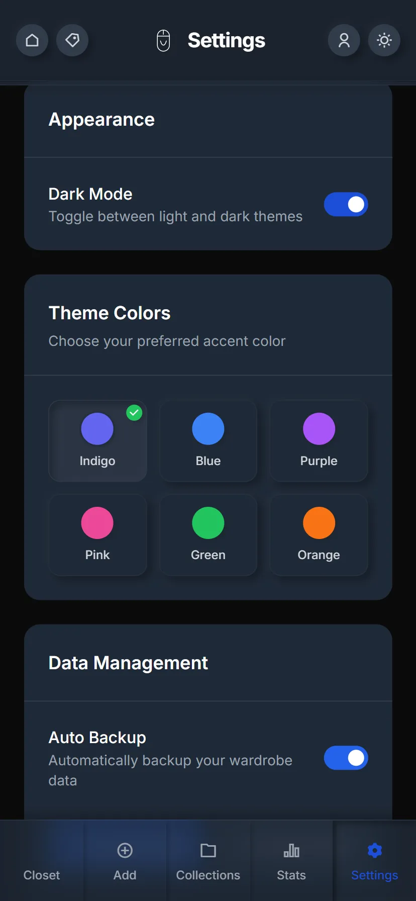
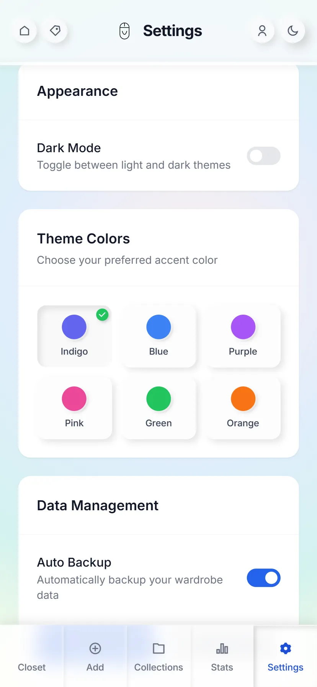
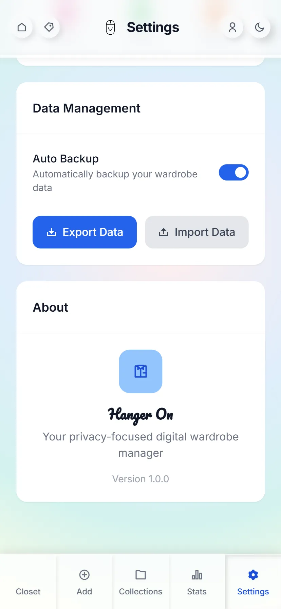
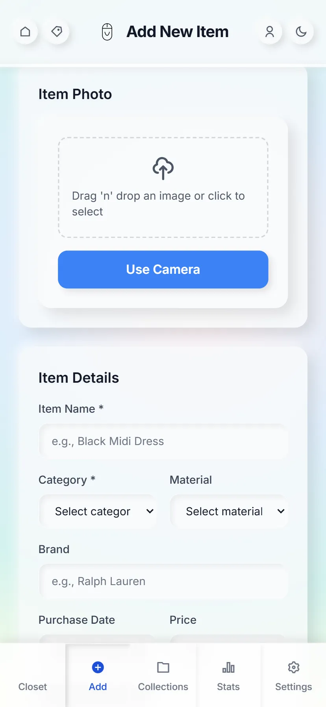

# Hanger On

A Next.js + TypeScript + TailwindCSS application for managing your wardrobe collections and tags.

This README is intentionally minimal and focused on installation and running the project. For now, only this README is tracked; all other docs are ignored per repository policy.

## Screenshots

Below are a few representative screenshots. We’ve selected a lightweight set to keep the repo lean.

<p align="center">
  
</p>

<p align="center">
  
</p>

<p align="center">
  
</p>

<p align="center">
  
</p>

## Quick Start

Prerequisites:
- Node.js 18+ (recommended)
- npm (comes with Node.js)

Install dependencies:

```
npm ci
```

Create local env file (adjust values to your environment):

```
cp .env.example .env.local
# then edit .env.local with your keys
```

Run development server:

```
npm run dev
```

Open http://localhost:3000 to view the app.

## Deployment

See [DEPLOYMENT.md](./DEPLOYMENT.md) for comprehensive production deployment instructions including:
- Vercel deployment setup
- Supabase database configuration
- Environment variables guide
- CI/CD pipeline details
- Troubleshooting and maintenance

## Notes
- Advanced/legacy docs that previously lived under docs/; are now removed/ignored to keep the repo lean.
- If you need deeper platform notes, check internal documentation or ask the maintainer.